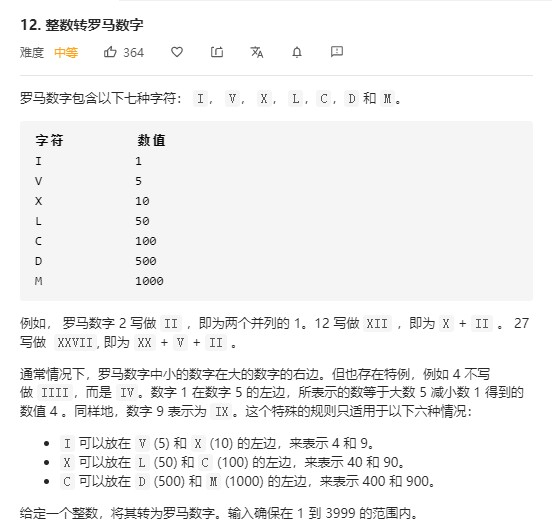
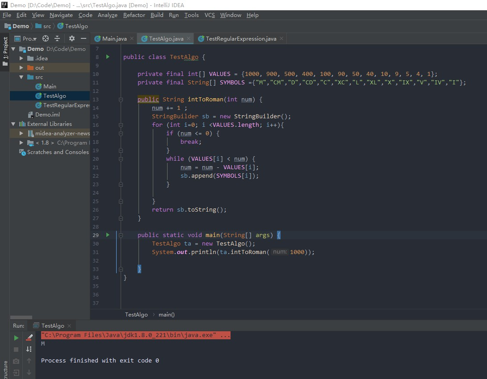

# AlgoNotes

> Algo笔记本, 用来记录一下平时刷LeetCode的

----

## 题目12：数字转换罗马数字
日期: 2020-7-15 [LeetCode #12](https://leetcode-cn.com/problems/integer-to-roman/submissions/)

> 题目描述: 

### 题解：（Python）


```python
class Solution:
    def intToRoman(self, num: int) -> str:
        digits = [(1000, "M"), (900, "CM"), (500, "D"), (400, "CD"), (100, "C"), (90, "XC"), 
              (50, "L"), (40, "XL"), (10, "X"), (9, "IX"), (5, "V"), (4, "IV"), (1, "I")]
        
        roman_digits = []
        for value,symbol in digits:
            if num == 0: break
            count, num = divmod(num, value)
            roman_digits.append(symbol * count)
        return "".join(roman_digits)

```

需要的函数: `divmod(被除数,除数)`, 返回的是(商,余数)。例如：`divmod(1024,1000)`的结果就是`(1,24)`.

### 题解：（Java）

```java
public class TestAlgo {

    private final int[] VALUES = {1000, 900, 500, 400, 100, 90, 50, 40, 10, 9, 5, 4, 1};
    private final String[] SYMBOLS ={"M","CM","D","CD","C","XC","L","XL","X","IX","V","IV","I"};

    public String intToRoman(int num) {
        num += 1 ;
        StringBuilder sb = new StringBuilder();
        for (int i=0; i <VALUES.length; i++){
            if (num <= 0) {
                break;
            }
            while (VALUES[i] < num) {
                num = num - VALUES[i];
                sb.append(SYMBOLS[i]);
            }

        }
        return sb.toString();
    }

    public static void main(String[] args) {
        TestAlgo ta = new TestAlgo();
        System.out.println(ta.intToRoman(1000));

    }
}
```

运行结果:


-----
## 题目1470：重新排列数组
日期: 2020-7-15 [LeetCode #1470](https://leetcode-cn.com/problems/shuffle-the-array/)

> 题目描述: 给你一个数组 nums ，数组中有 2n 个元素，按 [x1,x2,...,xn,y1,y2,...,yn] 的格式排列。

请你将数组按 [x1,y1,x2,y2,...,xn,yn] 格式重新排列，返回重排后的数组。


示例 1：

输入：nums = [2,5,1,3,4,7], n = 3
输出：[2,3,5,4,1,7] 
解释：由于 x1=2, x2=5, x3=1, y1=3, y2=4, y3=7 ，所以答案为 [2,3,5,4,1,7]

### 题解：（Python）


```python
#思路: 很简单, 就是看中间len/2, 而且n都给了,直接遍历一遍,创建一个新的数组返回就可以
class Solution:
    def shuffle(self, nums: List[int], n: int) -> List[int]:
        returnList = []
        for i in range(n):
            returnList.append(nums[i])
            returnList.append(nums[i+n])
        return returnList
```


----

## 题目02/03：删除中间节点
日期: 2020-7-15 [LeetCode #0203](https://leetcode-cn.com/problems/delete-middle-node-lcci/)

> 题目描述: 实现一种算法，删除单向链表中间的某个节点（即不是第一个或最后一个节点），假定你只能访问该节点。


示例：

输入：单向链表a->b->c->d->e->f中的节点c
结果：不返回任何数据，但该链表变为a->b->d->e->f

### 题解：（Python）


```python
'''
思路: 很简单, 已经不用判断是否是末尾是否是开头了, 
    1. 先看这个linked_list的数据结构和可以调用的方法
    2. 然后替换掉当前的node值,变为他的下一个node的val(值被替换了)
    3. 最后把那个指针指向原来的node的下一个(就是node.next.next)
'''
# Definition for singly-linked list.
# class ListNode:
#     def __init__(self, x):
#         self.val = x
#         self.next = None

class Solution:
    def deleteNode(self, node):
        """
        :type node: ListNode
        :rtype: void Do not return anything, modify node in-place instead.
        """
        node.val = node.next.val
        node.next = node.next.next
```


